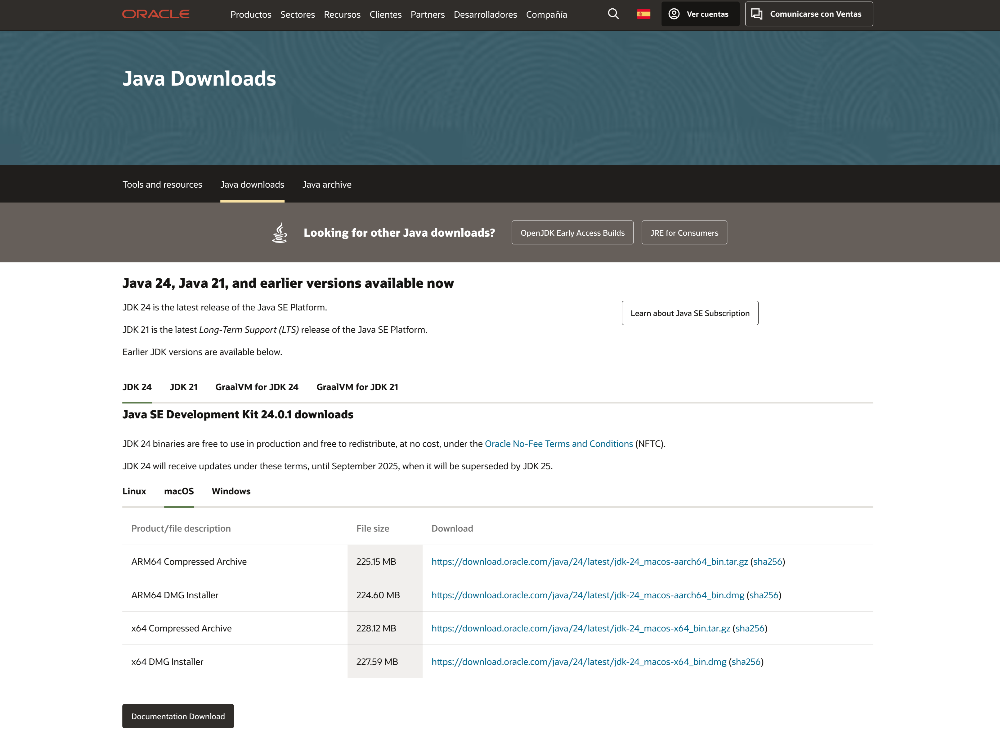
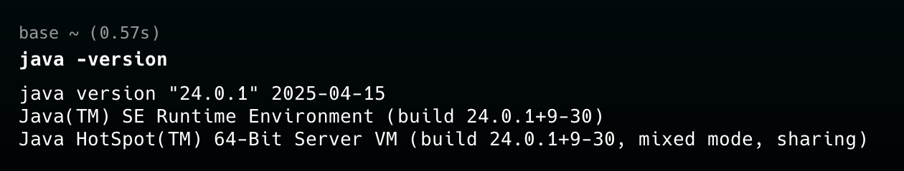

# Cómo instalar Java en macOS

Este documento describe las opciones para instalar Java en un Mac. Se cubren tres métodos: el [**instalador oficial de Oracle JDK**](#opción-1-instalador-oficial-de-oracle-jdk), la [instalación mediante **Homebrew**](#opción-2-instalación-mediante-homebrew) y la [instalación usando **Eclipse Adoptium** (OpenJDK)](#opción-3-instalación-mediante-eclipse-adoptium-openjdk).

> [!NOTE]
> A partir de 2025, Java 17 (LTS) y Java 21 son versiones con soporte a largo plazo. Ajusta la versión según tus necesidades de compatibilidad.

## Requisitos previos

- macOS 10.14 (Mojave) o superior.
- Acceso al terminal (Terminal.app o iTerm2).
- Derechos de administrador para instalar paquetes.

## Opción 1: Instalador oficial de Oracle JDK

1. Accede al [sitio oficial de Oracle](https://www.oracle.com/java/technologies/downloads/).

2. En la sección _"Java Downloads"_, selecciona la versión que necesites (por ejemplo, JDK 24) para macOS.

   

3. En la lista de instaladores, elige el paquete para **macOS aarch64** o **macOS x64** (según CPU: Apple Silicon o Intel).

4. Acepta el acuerdo de licencia y descarga el archivo `.dmg`.

5. Abre el `.dmg` descargado y sigue las instrucciones para instalar JDK en tu Mac.

6. Una vez copiado, abre Terminal y verifica la instalación ejecutando:

   ```sh
   java -version
   ```

   Deberías ver algo similar a:

   

7. Si necesitas configurar la variable `JAVA_HOME`, añade al final de tu perfil de shell (`~/.zshrc` o `~/.bash_profile`) la línea:

   ```sh
   export JAVA_HOME=$(/usr/libexec/java_home)
   ```

   Luego recarga:

   ```sh
   source ~/.zshrc   # o source ~/.bash_profile
   ```

## Opción 2: Instalación mediante Homebrew

[Homebrew](https://brew.sh) es el gestor de paquetes más usado en macOS. Permite instalar OpenJDK sin necesidad de descargar manualmente archivos .dmg.

1. Abre la terminal.

2. Si aún no tienes Homebrew instalado, ejecuta:

   ```sh
   /bin/bash -c "$(curl -fsSL https://raw.githubusercontent.com/Homebrew/install/HEAD/install.sh)"
   ```

   Sigue las instrucciones en pantalla para completar la instalación.

   Verifica que `brew` esté en tu `PATH` ejecutando `brew --version`.

3. Para [instalar OpenJDK](https://formulae.brew.sh/formula/openjdk), ejecuta:

   ```sh
   brew install openjdk
   ```

   Homebrew descarga y compila la versión de OpenJDK desde fuentes oficiales.

4. Una vez instalado, Homebrew mostrará advertencias para configurar el `PATH`. Por ejemplo:

   ```sh
   For the system Java wrappers to find this JDK, symlink it with
      sudo ln -sfn /usr/local/opt/openjdk@23/libexec/openjdk.jdk /Library/Java/JavaVirtualMachines/openjdk-23.jdk

   Add to your profile:
      export PATH="/usr/local/opt/openjdk@23/bin:$PATH"
   ```

   Ejecuta el comando sugerido para crear el enlace simbólico en `/Library/Java/JavaVirtualMachines/` (requiere contraseña de administrador).

   Añade la línea de `export PATH=...` al final de `~/.zshrc` o `~/.bash_profile` según uses Zsh o Bash:

   ```sh
   echo 'export PATH="/usr/local/opt/openjdk/bin:$PATH"' >> ~/.zshrc  # Si usas Zsh
   echo 'export PATH="/usr/local/opt/openjdk/bin:$PATH"' >> ~/.bash_profile  # Si usas Bash
   ```

5. Recarga tu perfil de shell o reinicia la terminal para aplicar los cambios.

   ```sh
   source ~/.zshrc   # o source ~/.bash_profile
   ```

6. Verifica la versión de Java:

   ```sh
   java -version
   ```

   Deberías ver la versión de OpenJDK instalada. Salida de ejemplo:

   ```sh
   openjdk version "23.0.2" 2024-01-15
   OpenJDK Runtime Environment Homebrew (build 23.0.2+0)
   OpenJDK 64-Bit Server VM Homebrew (build 23.0.2+0, mixed mode, sharing)
   ```

## Opción 3: Instalación mediante Eclipse Adoptium (OpenJDK)

[Eclipse Adoptium](https://adoptium.net/) (anteriormente AdoptOpenJDK) distribuye builds oficiales de OpenJDK. Es una alternativa confiable y de alto rendimiento.

1. Abre un navegador y accede a:
   [https://adoptium.net/temurin/releases/](https://adoptium.net/temurin/releases/)

2. Elige la versión LTS (por ejemplo, **Temurin 21**) y descarga el instalador para **macOS x64 .pkg** o **macOS aarch64 .pkg**.

3. Ejecuta el paquete `.pkg` y sigue los pasos del instalador. Esto ubicará OpenJDK en `/Library/Java/JavaVirtualMachines/`.

4. Verifica la instalación:

   ```sh
   java -version
   ```

   Deberías ver algo así:

   ```
   openjdk version "21.0.2" 2024-01-15
   OpenJDK Runtime Environment Temurin-21.0.2+7 (build 21.0.2+7)
   OpenJDK 64-Bit Server VM Temurin-21.0.2+7 (build 21.0.2+7, mixed mode, sharing)
   ```

5. Si deseas tener varias versiones de Java y cambiar entre ellas, asegúrate de que tu perfil de shell apunte a la versión adecuada:

   ```sh
   export JAVA_HOME=$(/usr/libexec/java_home -v 21)
   export PATH="$JAVA_HOME/bin:$PATH"
   ```

   Para ver todas las versiones instaladas:

   ```sh
   /usr/libexec/java_home -V
   ```

   Para apuntar a Java 17, por ejemplo:

   ```sh
   export JAVA_HOME=$(/usr/libexec/java_home -v 17)
   ```
