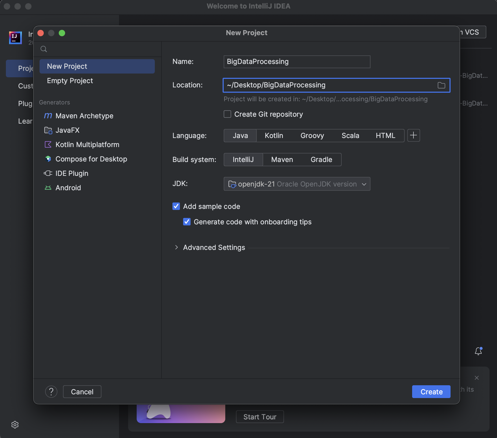
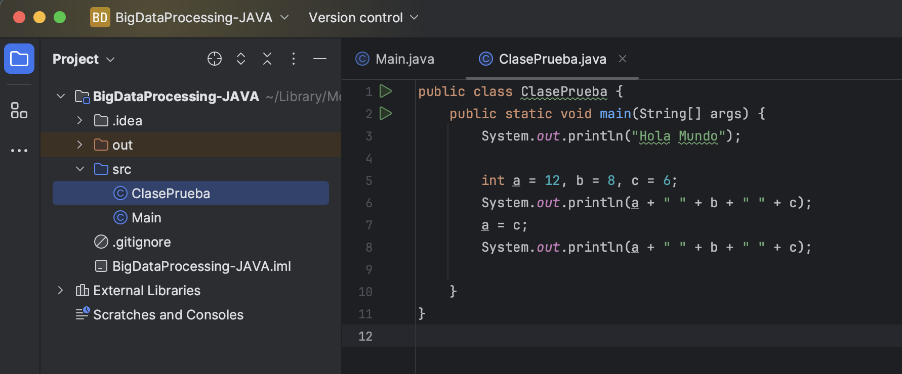
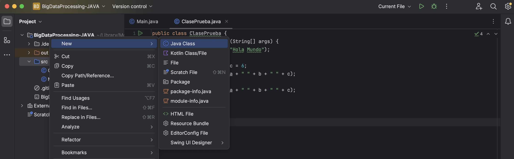

# Creación de un Proyecto Java en IntelliJ

[IntelliJ IDEA](https://www.jetbrains.com/es-es/idea/) es el IDE de referencia para desarrolladores Java. En este apartado se explica paso a paso cómo crear un proyecto Java en IntelliJ y se mencionan los elementos esenciales de una aplicación.

## Índice de contenidos

- [Requisitos previos](#requisitos-previos)
- [Crear un proyecto Java nuevo](#crear-un-proyecto-java-nuevo)
- [Estructura del proyecto](#estructura-del-proyecto)
- [Crear la Clase con `main()`](#crear-la-clase-con-main)
- [Compilar y Ejecutar](#compilar-y-ejecutar)
- [Ajustes de Configuración Adicionales](#ajustes-de-configuración-adicionales)
- [Elementos Fundamentales](#lementos-fundamentales)
- [Buenas Prácticas al Crear Proyectos Java](#buenas-prácticas-al-crear-proyectos-java)

## Requisitos Previos

- **IntelliJ IDEA**: Descarga e instala la edición Community o Ultimate desde https://www.jetbrains.com/idea/download/.
- **JDK instalado**: Asegúrate de tener un JDK 11, 17 o posterior configurado en tu sistema (ver [Instalar Java en macOS](./1-Instalar-Java-en-Mac.md)).

## Crear un Proyecto Java Nuevo

1. **Abrir IntelliJ IDEA**

   - Si es la primera ejecución, IntelliJ mostrará la pantalla de inicio.
   - En caso contrario, ve a **File → Close Project** para regresar a la bienvenida.

2. **Nuevo Proyecto**

   - En la pantalla de bienvenida, haz clic en **New Project**.
   - En el panel izquierdo elige **Java**.
   - Asegúrate de que en "Project SDK" aparezca el JDK que instalaste (por ejemplo, `Java 21`). Si no está, pulsa **Add SDK → JDK** y selecciona la carpeta de instalación del JDK.
   - Opción recomendada: activa “Create project from template” y elige “Command Line App” para generar automáticamente el boceto de una clase con `main()`.

3. **Configurar Nombre y Ubicación**

   - En **Name** escribe, por ejemplo, `MiProyectoJava`.
   - En **Location** selecciona la ruta donde se guardará el proyecto.
   - La opción “Use Maven/Gradle” puede permanecer desactivada si sólo quieres un proyecto Java puro. Si en el futuro usarás dependencias, considera crear un proyecto Maven o Gradle.

   

4. **Finalizar Creación**
   - Pulsa **Finish**. IntelliJ generará la estructura básica y abrirá el proyecto.

## Estructura del Proyecto

Al crear un proyecto “Command Line App” sin Maven/Gradle, IntelliJ genera algo similar a:

```markdown
MiProyectoJava/
├─ .idea/
├─ out/
│ └─ production/
│ └─ MiProyectoJava/
│ └─ Main.class
├─ src/
│ └─ Main.java
├─ MiProyectoJava.iml
└─ .gitignore
```



- **.idea/**: Configuración interna de IntelliJ (no versionar)
- **src/**: Carpeta donde van todos los archivos `.java`
- **out/**: Directorio de compilación (archivos `.class`), definido por IntelliJ (no versionar)
- **MiProyectoJava.iml**: Módulo de IntelliJ
- **.gitignore**: Recomendado ignorar `/out/`, `*.iml` y carpetas temporales

Si eliges un proyecto Maven, la estructura será:

```markdown
MiProyectoJava/
├─ .idea/
├─ pom.xml
├─ src/
│ ├─ main/
│ │ └─ java/
│ │ └─ com/tuempresa/miproyecto/App.java
│ ├─ test/
│ │ └─ java/
```

- **pom.xml**: Archivo de configuración Maven.
- **src/main/java/**: Código fuente principal.
- **src/test/java/**: Tests unitarios.

## Crear la Clase con `main()`

1. **Desde la carpeta `src`**

   - En el panel de proyecto, expande `src`. Haz clic derecho sobre `src` y selecciona **New → Java Class**.
   - En **Name**, escribe `App` (u otro nombre descriptivo).
   - Asegúrate de que la casilla “public static void main(String[] args)” esté marcada (si creaste el proyecto con plantilla, IntelliJ ya la habrá generado).

    

2. **Verificar Firma del Método `main()`**

   ```java
   public class App {
       public static void main(String[] args) {
           // Todo programa Java empieza aquí
           System.out.println("¡Proyecto Java en IntelliJ funciona!");
       }
   }

   ```

   Ver más información en: [**El método `main()`**](#el-método-main)

<br>

3. **Paquetes** _(opcional pero recomendado)_

   Si quieres organizar código por paquetes, crea carpetas anidadas. Por ejemplo:

   ```
   src/
   └─ com/
       └─ miempresa/
           └─ miproyecto/
               └─ App.java
   ```

   En ese caso, la primera línea de `App.java` debe ser:

   ```java
   package com.miempresa.miproyecto;
   ```

## Compilar y Ejecutar

**Ejecutar desde IntelliJ**

- Haz clic en el icono ▶️ junto a la declaración de `main()`, o bien selecciona el archivo en el panel izquierdo y pulsa botón secundario → **Run 'App.main()'**.
- En la consola de IntelliJ se verá:

  ```
  ¡Proyecto Java en IntelliJ funciona!
  ```

**Compilar y ejecutar manualmente** (línea de comandos)

1. Abre una terminal y navega hasta la carpeta raíz del proyecto (donde está `src/`).
2. Compila:

   ```sh
   javac -d out/production/MiProyectoJava src/com/miempresa/miproyecto/App.java
   ```

3. Ejecuta:

   ```sh
   java -cp out/production/MiProyectoJava com.miempresa.miproyecto.App
   ```

## Ajustes de Configuración Adicionales

1. **Configuración del SDK**

   - Ve a **File → Project Structure → Project**, y en “Project SDK” selecciona el JDK adecuado.
   - En **Project Language Level**, selecciona la versión de sintaxis de Java (por ejemplo, “17 – Sealed types, pattern matching for switch”).

2. **Configurar Artefacto (si usas Maven/Gradle)**

   - Con Maven: edita `pom.xml` para incluir dependencias de Hadoop, Spark, etc.
   - Con Gradle: en `build.gradle` agrega las líneas necesarias para `implementation 'org.apache.hadoop:hadoop-common:3.3.4'`, por ejemplo.

3. **Agregar Librerías Externas**

   - En un proyecto sin Maven/Gradle, ve a **File → Project Structure → Libraries** y añade los JAR que necesites (por ejemplo, `hadoop-common.jar`).
   - Mejor práctica: usar Maven o Gradle para gestionar dependencias y evitar conflictos de versiones.

## Elementos Fundamentales

### El método `main()`

- **Punto de entrada**: La JVM busca `public static void main(String[] args)` para iniciar la ejecución.
  - `public`: visible para la JVM.
  - `static`: invocable sin instancia de clase.
  - `void`: no retorna valor.
- **`String[] args`**: Permite pasar parámetros desde la línea de comandos.
  - Por ejemplo, si ejecutas `java App hola mundo`, `args[0]` será `"hola"` y `args[1]` será `"mundo"`.

### Estructura de una Clase Java

```java
package com.miempresa.miproyecto; // Ubicación lógica del archivo

// Importaciones (sólo si usas clases externas)
// import java.util.List;

public class App {  // Definición de la clase pública

    // Variables de instancia (no estáticas)
    private int contador;

    // Constructor
    public App() {
        this.contador = 0;
    }

    // Método de instancia
    public void incrementar() {
        contador++;
    }

    // Método estático: no requiere instancia
    public static void mostrarMensaje(String msg) {
        System.out.println(msg);
    }

    // Punto de entrada
    public static void main(String[] args) {
        // Crear una instancia de App
        App app = new App();

        // Llamar a un método de instancia
        app.incrementar();

        // Llamar a un método estático
        mostrarMensaje("Contador inicializado: " + app.contador);

        // Ejemplo de bucle for
        for (int i = 0; i < 3; i++) {
            app.incrementar();
        }
        mostrarMensaje("Contador tras bucle: " + app.contador);
    }
}
```

- **`package`**: Define el namespace de la clase.
- **Campos (atributos)**: Variables que pertenecen a cada instancia.
- **Constructores**: Métodos especiales que inicializan el objeto.
- **Métodos de instancia**: Operan sobre datos de esa instancia.
- **Métodos estáticos**: Pertenecen a la clase y no requieren objeto.
- **Visibilidad**: `public`, `protected`, `private` o package-private (sin modificador).

## Buenas Prácticas al Crear Proyectos Java

**Usar un Gestor de Dependencias (Maven/Gradle)**

- Facilita la integración con frameworks Big Data (Hadoop, Spark, Kafka).
- Permite empaquetar en “uber JAR” para despliegue en clúster (con `maven-shade-plugin` o `shadowJar`).

**Organizar Código por Paquetes**

- Mantén claro el dominio de cada módulo:

  ```
  com.miempresa.miapp/
     ├─ config/
     ├─ model/
     ├─ service/
     ├─ util/
     └─ Main.java
  ```

**Comentarios y JavaDoc**

- Documenta clases y métodos públicos con JavaDoc (`/** ... */`) para generar automáticamente documentación API.

**Control de Versiones**

- Incluye un archivo `.gitignore` (ej. ignorar `/out/`, archivos `.iml`, `/target/`, `/build/`).
- Inicializa repositorio Git y crea commits frecuentes:

  ```sh
  git init
  git add .
  git commit -m "Proyecto Java inicial en IntelliJ"
  ```
