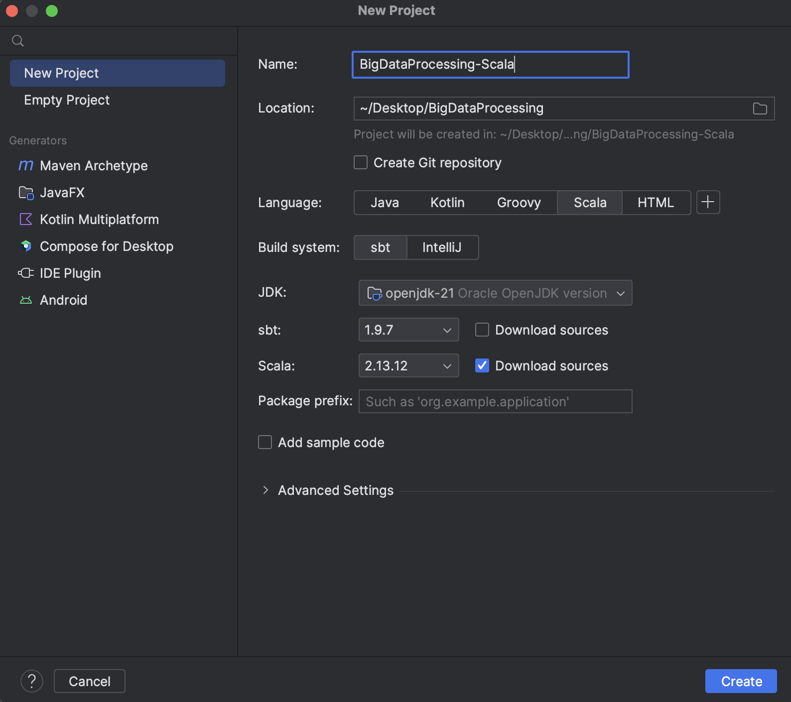
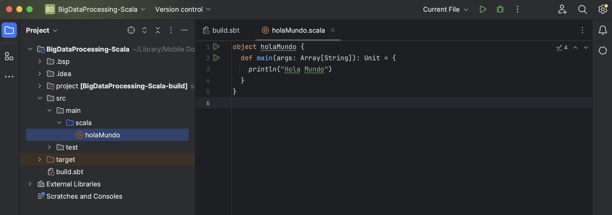

# Crear proyecto Scala en IntelliJ IDEA

Este tutorial muestra cómo configurar desde cero un proyecto Scala en IntelliJ IDEA (Community o Ultimate), de manera que puedas empezar a escribir código y compilarlo sin complicaciones. A lo largo del proceso configuraremos el SDK de Scala y mostraremos cómo estructurar un proyecto con SBT (Scala Build Tool).

## Requisitos previos

- **IntelliJ IDEA**

  - [Descarga e instala IntelliJ IDEA](https://www.jetbrains.com/idea/download/) (edición Community o Ultimate)

- **JDK instalado**

  - Tener un JDK 8, 11 o 17 configurado en tu sistema. Comprueba con:

    ```bash
    java -version
    ```

  - Si no está instalado, revisa [Instalar Java en macOS](../Java/1-Instalar-Java-en-Mac.md) (o equivalente para tu SO).

- **SBT (recomendado)**
  - Opcionalmente, puedes [instalar SBT](https://www.scala-sbt.org/download.html) para gestionar dependencias y compilaciones.
  - Si no deseas instalar SBT globalmente, IntelliJ también puede descargar e instalar una versión local.

## Crear un proyecto Scala nuevo (SBT)

1. **Abre IntelliJ**

   - En la **pantalla de bienvenida**, haz clic en **New Project**.

2. **Selecciona Scala/SBT**

   - En el panel izquierdo selecciona **Scala**.
   - A la derecha, marca la opción **sbt**.
   - En “Project SDK” elige el JDK que has instalado (p. ej., `Java 17`).
   - Si en “Scala SDK” no aparece ninguna versión, pulsa **Install automatically** y elige la versión estable (recomendado: Scala 2.13.x o Scala 3.x).

3. **Configurar nombre y ubicación**

   - **Name**: `MiProyectoScala` (o el nombre que prefieras).
   - **Location**: carpeta donde se guardará el proyecto.
   - **sbt Version**: se sugiere la última estable (p. ej., `1.9.x`).
   - **Scala Version**: elige la versión instalada (p. ej., `2.13.10`).

      

4. **Finalizar creación**

   - Haz clic en **Create**. IntelliJ descargará dependencias base de SBT y generará la siguiente estructura:

     ```
     MiProyectoScala/
     ├─ .idea/
     ├─ build.sbt
     ├─ project/
     │   └─ build.properties
     ├─ src/
     │   ├─ main/
     │   │   └─ scala/
     │   │       └─ Main.scala
     │   └─ test/
     │       └─ scala/
     └─ .gitignore
     ```

      

   - **`build.sbt`**: en este archivo se definen las dependencias y la configuración del proyecto. Por defecto:
     ```scala
     name := "MiProyectoScala"
     version := "0.1.0-SNAPSHOT"
     scalaVersion := "2.13.10"
     ```

## Estructura del proyecto

**`build.sbt`** - Configuración principal de SBT. Se puede ampliar incluyendo dependencias:

```scala
libraryDependencies ++= Seq(
   "org.apache.spark" %% "spark-core" % "3.4.1",
   "org.apache.spark" %% "spark-sql"  % "3.4.1"
)
```

**`project/build.properties`** - Especifica la versión de SBT:

```
sbt.version=1.8.5
```

**`src/main/scala/`** - Código fuente principal. Por defecto IntelliJ crea un archivo `Main.scala`:

```scala
object Main {
  def main(args: Array[String]): Unit = {
    println("¡Hola, Scala en IntelliJ!")
  }
}
```

**`src/test/scala/`** - Tests unitarios (si planeas usar ScalaTest o Specs2).

**`.gitignore`** - Debe incluir:

```
# IntelliJ
.idea/
*.iml

# SBT
target/
project/target/
project/project/

# Archivos temporales
*.log
*.class
```

_(Completa según tus necesidades)_

## Primer “Hello, World!” en Scala

1. **Examina `Main.scala`**

   ```scala
   object Main {
     def main(args: Array[String]): Unit = {
       println("¡Hola, Scala en IntelliJ!")
     }
   }
   ```

2. **Ejecuta desde IntelliJ**

   - Haz clic derecho sobre el archivo `Main.scala` → **Run 'Main'**.
   - En la consola de IntelliJ verás:

     ```
     ¡Hola, Scala en IntelliJ!
     ```

   - Alternativamente, selecciona la configuración de “Main” en la esquina superior derecha y pulsa el botón ▶.

3. **Compilar y ejecutar desde SBT (terminal integrada)**

   - Abre la pestaña **Terminal** en IntelliJ (o usa tu terminal externo).
   - Ejecuta:

     ```bash
     sbt compile
     sbt run
     ```

   - Obtendrás la misma salida.

## Agregar dependencias de Big Data (Spark)

Para preparar tu proyecto a trabajar con Spark, edita `build.sbt` y añade:

```scala
libraryDependencies ++= Seq(
  "org.apache.spark" %% "spark-core" % "3.4.1" % "provided",
  "org.apache.spark" %% "spark-sql"  % "3.4.1" % "provided"
)
```

- El _scope_ `"provided"` indica que en tiempo de compilación se resuelven las dependencias, pero en tiempo de ejecución (cluster) las provee Spark.
- Si necesitas Spark local para pruebas, puedes omitir `"provided"`.

Ejemplo completo de `build.sbt`:

```scala
name := "MiProyectoScala"

version := "0.1.0-SNAPSHOT"

scalaVersion := "2.13.10"

libraryDependencies ++= Seq(
  "org.apache.spark" %% "spark-core" % "3.4.1" % "provided",
  "org.apache.spark" %% "spark-sql"  % "3.4.1" % "provided"
)
```

Luego, en la terminal:

```bash
sbt update   # Descarga dependencias
sbt compile
```

## Buenas prácticas

1. **Separar lógica de negocio y configuración**

   - Mantén tu lógica en `src/main/scala/com/miempresa/…`, nunca directamente en la raíz de `scala/`.
   - Usa paquetes para agrupar clases relacionadas.

2. **Trabajar con paquetes y convenciones de nombres**

   - Carpeta `com/miempresa/miproyecto/`.
   - Clases en PascalCase (`EjemploSpark.scala`, `ProcesadorDatos.scala`).

3. **Usar .gitignore apropiado**

   - Ignorar todas las carpetas `target/` y `.idea/`.
   - No subir archivos de configuración locales ni .class.

4. **Documentación**

   - Agrega comentarios ScalaDoc (`/** … */`) en las clases públicas.
   - Si desarrollas librerías, genera documentación con SBT:

     ```bash
     sbt doc
     ```

5. **Gestión de versiones de Scala**

   - Comprueba compatibilidad entre Scala y la versión de Spark que usarás.
   - Spark 3.4.x funciona con Scala 2.12 y 2.13 (recomendado 2.13.x).

## Enlaces de interés

- **Documentación oficial de IntelliJ para Scala**: https://www.jetbrains.com/help/idea/getting-started-with-scala-support.html
- **Guía de SBT (Scala Build Tool)**: https://www.scala-sbt.org/1.x/docs/Getting-Started.html
- **Apache Spark con Scala**: https://spark.apache.org/docs/latest/api/scala/index.html
- **Rock the JVM’s Scala Courses**: https://rockthejvm.com/
