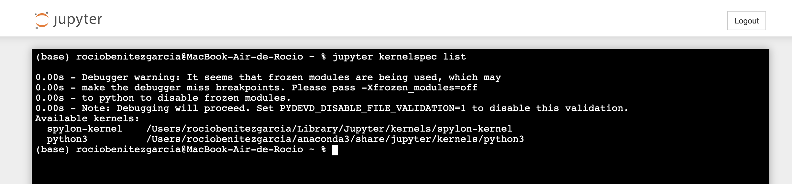
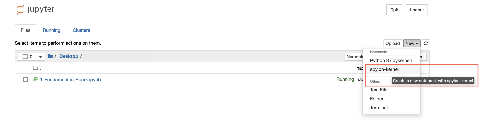

# Uso de Scala en Jupyter Notebook con el kernel Spylon

Este documento explica cómo instalar y configurar el kernel **Spylon** para ejecutar código Scala en Jupyter Notebook. De este modo, podrás escribir y probar fragmentos de Scala de forma interactiva.

## Índice de contenidos

- [Requisitos previos](#requisitos-previos)
- [Instalar el kernel Spylon](#instalar-el-kernel-spylon)
- [Iniciar Jupyter y seleccionar el kernel](#iniciar-jupyter-y-seleccionar-el-kernel)
- [Ejemplos básicos en la consola de Scala (notebook)](#ejemplos-básicos-en-la-consola-de-scala-notebook)
- [Verificar instalación y solucionar problemas](#verificar-instalación-y-solucionar-problemas)
- [Buenas prácticas en notebooks Scala](#buenas-prácticas-en-notebooks-scala)
- [Enlaces de referencia](#enlaces-de-referencia)

## Requisitos previos

1. **Java y Scala instalados**

   - Un JDK 8, 11 o 17. Comprueba con:

     ```bash
     java -version
     ```

   - Scala (opcional, pero útil para verificar):

     ```bash
     scala -version
     ```

   - Si no los tienes, revisa [Instalar Java en macOS](../Java/1-Instalar-Java-en-Mac.md) o la guía de instalación en https://www.scala-lang.org/download/.

2. **Python 3 y pip**

   - Jupyter Notebook requiere Python 3.6+.
   - Asegúrate de que `pip` esté actualizado:

     ```bash
     pip install --upgrade pip
     ```

3. **Jupyter Notebook o JupyterLab**

   - Instala Jupyter Notebook con:

     ```bash
     pip install notebook
     ```

   - O bien JupyterLab (recomendado para entornos más avanzados):

     ```bash
     pip install jupyterlab
     ```

## Instalar el kernel Spylon

Spylon es un kernel de Jupyter que permite ejecutar Scala. Para instalarlo:

1. **Instalar el paquete**

   ```bash
   pip install spylon-kernel
   ```

2. **Registrar el kernel en Jupyter**

   ```bash
   python -m spylon_kernel install --user
   ```

   - El flag `--user` instala el kernel sólo para el usuario actual.
   - Puedes verificar que se haya registrado correctamente con:

     ```bash
     jupyter kernelspec list
     ```

     Deberías ver una entrada como `spylon-kernel`.

        

## Iniciar Jupyter y seleccionar el kernel

### Abrir Jupyter Notebook

```bash
jupyter notebook
```

o, si usas JupyterLab:

```bash
jupyter lab
```

### Crear un nuevo cuaderno Scala

- En la interfaz web, pulsa **New → spylon-kernel** (o “Scala” si aparece con ese nombre).

    

- Se abrirá un Notebook con una celda CPI (Scala REPL). Verás un mensaje del tipo:

  ```
  Initializing Scala interpreter...
  ```

- Ahora podrás escribir código Scala directamente y ejecutarlo:

  ```scala
  val mensaje = "¡Hola desde Scala en Jupyter!"
  println(mensaje)
  ```

## Ejemplos básicos en la consola de Scala (notebook)

### Operaciones elementales

```scala
val x = 10
val y = 3
x + y           // Resultado: 13
x * y           // Resultado: 30
x / y           // Resultado: 3
x.toDouble / y  // Resultado: 3.3333333333333335
```

### Definir funciones

```scala
def sumar(a: Int, b: Int): Int = a + b
sumar(5, 7)   // Devuelve 12
```

### Colecciones e inmutabilidad

```scala
val lista = List(1, 2, 3, 4, 5)
val cuadrados = lista.map(n => n * n)    // List(1, 4, 9, 16, 25)
val filtrados = lista.filter(_ % 2 == 0) // List(2, 4)
```

### Uso de Spark (si está instalado)

- Si quieres probar Spark en Jupyter con Scala, debes configurar `SPARK_HOME` y añadir la ruta a `spark-shell`.
- Ejemplo mínimo (en la misma celda):

  ```scala
  import org.apache.spark.sql.SparkSession

  val spark = SparkSession.builder()
     .appName("ScalaNotebook")
     .master("local[*]")
     .getOrCreate()

  val datos = Seq(("Ana", 28), ("Luis", 34), ("María", 23))
  import spark.implicits._
  val df = datos.toDF("nombre", "edad")
  df.show()
  ```

- Esto desplegará una tabla con dos columnas (`nombre`, `edad`) directamente en el notebook.

## Verificar instalación y solucionar problemas

- **Comprobar que aparece `spylon-kernel`**:

  ```bash
  jupyter kernelspec list
  ```

  Debe listar algo parecido a:

  ```
  python3           /usr/local/share/jupyter/kernels/python3
  spylon-kernel     /Users/tu_usuario/Library/Jupyter/kernels/spylon-kernel
  ```

- **Problema: “Kernel died, restarting”**

  1. Asegúrate de que la variable `SCALA_HOME` esté definida (opcional, pero a veces ayuda).

     ```bash
     export SCALA_HOME=/usr/local/scala
     export PATH=$SCALA_HOME/bin:$PATH
     ```

  2. Reinstala Spylon Kernel y vuelve a registrar:

     ```bash
     pip uninstall spylon-kernel
     pip install spylon-kernel
     python -m spylon_kernel install --user
     ```

- **Usar otro kernel de Scala**

  - Alternativas más recientes (si necesitas Scala 2.13 o 3.x) son `almond` (kernel de Scala para Jupyter). En ese caso:

    ```bash
    coursier launch almond -- --install
    ```

  - Documentación de Almond: https://almond.sh/docs/installation.html

## Buenas prácticas en notebooks Scala

- **Mantén celdas pequeñas y temáticas**: Separar creación de variables, definiciones de funciones y visualizaciones en células distintas.

- **Documentación en Markdown**: Añade bloques Markdown entre celdas de código para explicar pasos o resultados.

- **Guardar el kernel Scala específico**: Si trabajas con proyectos Spark grandes, crea un archivo de configuración `kernel.json` personalizado con `SPARK_HOME` y dependencias.

- **Versionar notebooks**: Incluye solo el código y notas en texto. Evita guardar celdas con salida demasiado grande (o usa un `.gitignore` para ignorar las salidas).

## Enlaces de referencia

- **Spylon Kernel en PyPI**: https://pypi.org/project/spylon-kernel/
- **Documentación de Almond (kernel Scala)**: https://almond.sh/
- **Guía Scala en Jupyter oficial**: https://docs.scala-lang.org/tutorials/jupyter.html
- **Apache Toree (otro kernel para Spark+Scala)**: https://toree.apache.org/
- **Documentación oficial de Jupyter**: https://jupyter.org/documentation
